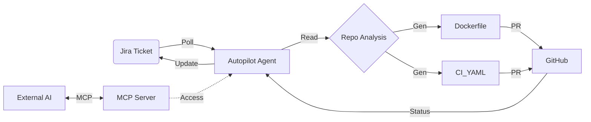

# Agents

This repository contains and defines the following autonomous agents and interfaces.

## 1. Jira Autopilot Agent
**Type**: Autonomous Service (Loop)
**Runtime**: Node.js (`server.js`)
**Role**: DevOps Engineer

### Profile
The **Jira Autopilot** is a fully autonomous agent designed to sit between your Project Management tool (Jira) and your Codebase (GitHub). It acts as a specialized DevOps engineer that picks up tasks and executes them without human intervention.

### Capabilities
| Skill | Description |
| :--- | :--- |
| **Monitoring** | Polls Jira every 30s for high-priority tickets in the "To Do" column. |
| **Context Awareness** | "Reads" the target repository to detect the tech stack (Node.js, Python, .NET). |
| **Construction** | Authoring of Infrastructure-as-Code files:   - CI/CD Workflows (`.github/workflows/*.yml`)   - Container Definitions (`Dockerfile`) |
| **Deployment** | Manages Git lifecycle: Branching, Committing, and Opening Pull Requests. |
| **reporting** | Transitions Jira tickets and posts comments with results (Success/Failure). |

---

## 2. Model Context Protocol (MCP) Interface
**Type**: Agent Tool Provider
**Runtime**: Node.js (`mcpServer.js`)
**Role**: Interface Layer

### Profile
This component allows **External AI Agents** (like Claude Desktop or IDE Assistants) to "plug in" to the Automation Service. It exposes the service's internal state and logic as callable tools.

### Exposed Tools
-   `generate_workflow_yaml`: Ask the agent to draft a CI/CD pipeline for a specific stack.
-   `check_pr_status`: Ask the agent to report the live result of a specific Pull Request.
-   `autopilot://status`: A resource URI to read the live JSON state of the system queue.

---

## Agent Workflow

