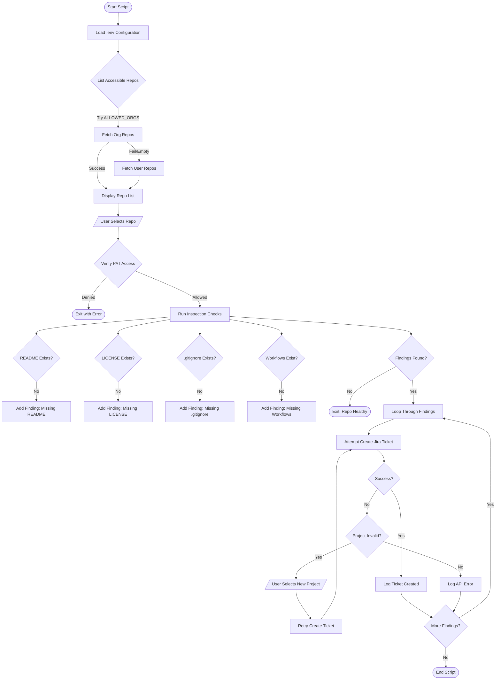

# GitHub Repo Inspector Manual

This document details the workflow and usage of the `scripts/inspect_repo.js` automation tool. This tool is designed to audit GitHub repositories for compliance with engineering standards and automatically report issues to Jira.

## 1. Overview

The Repo Inspector scans a target GitHub repository for the presence of essential files and configurations. If any required item is missing, it automatically raises a Jira Task to address the gap.

**Key Checks:**
-   **README.md**: Documentation existence.
-   **LICENSE**: Open source or proprietary license file.
-   **.gitignore**: Source control ignore rules.
-   **CI/CD Workflows**: Existence of workflow files in `.github/workflows`.

## 2. Workflow Diagram

The following flowchart illustrates the script's execution logic:



## 3. Usage Guide

### Prerequisites
Ensure your `.env` file is configured with:
-   `GHUB_TOKEN`: A GitHub Personal Access Token with `repo` and `read:org` scopes.
-   `JIRA_BASE_URL`, `JIRA_USER_EMAIL`, `JIRA_API_TOKEN`: Jira credentials.
-   `JIRA_PROJECT_KEY`: Default Jira project to create tickets in (e.g., `DOT`).
-   `ALLOWED_ORGS` (Optional): Comma-separated list of GitHub Orgs to scan.

### Running the Script
Open your terminal and run:

```bash
node scripts/inspect_repo.js
```

### Interactive Steps
1.  **Select Repository**: 
    -   The script will display a numbered list of repositories.
    -   Type the number to select one, or type `owner/repo` manually.
2.  **Monitor Progress**:
    -   The script verifies access and prints the status of each check.
3.  **Project Selection (Fallback)**:
    -   If the configured `JIRA_PROJECT_KEY` is invalid, the script will pause.
    -   It will list all available Jira projects.
    -   Select the correct project to proceed with ticket creation.

## 4. Error Handling

-   **Repo Access Denied**: Double-check your `GHUB_TOKEN` and ensure you have admin/read rights to the repository.
-   **Jira API Errors**: 
    -   401/403: Check your Jira API Token and Email.
    -   400 (Project Required): The script handles this by prompting for a new project.
